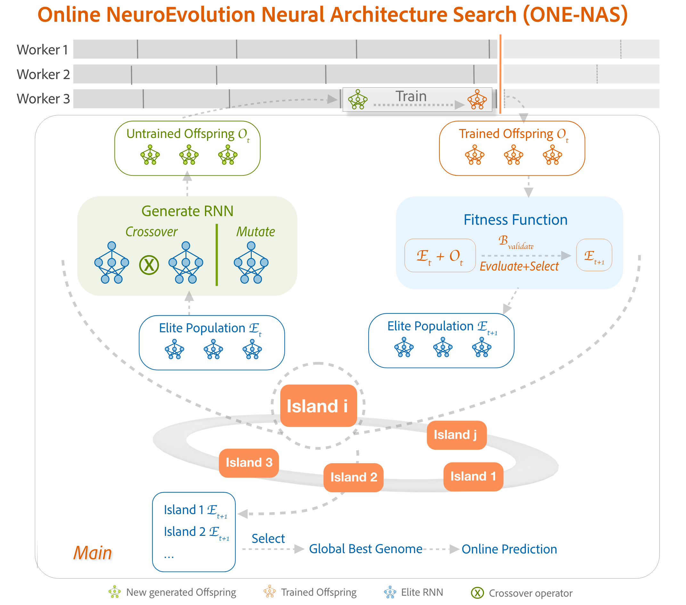

<p align="center">
  
</p>

# ONE-NAS: Online NeuroEvolution-based Neural Architecture Search

ONE-NAS (Online NeuroEvolution-based Neural Architecture Search) is the first evolutionary algorithm capable of designing and training RNNs in real-time as data arrives in an online fashion. Unlike traditional time series forecasting methods that require offline pre-training, ONE-NAS continuously evolves both the structure and weights of Recurrent Neural Networks in response to streaming data. The algorithm utilizes island-based evolutionary strategies with repopulation techniques to maintain diversity and prevent catastrophic forgetting, while training new genomes on subsets of historical data to handle data drift effectively.

Implemented in C++ and built on the same foundation as EXAMM, ONE-NAS is designed for distributed computation and offers excellent scalability from personal laptops to high-performance computing clusters. The system employs a distributed architecture where worker processes handle RNN training while a main process manages population evolution and orchestrates the overall evolutionary process. ONE-NAS has been evaluated on real-world datasets including wind turbine sensor data and financial time series, demonstrating superior performance compared to classical TSF methods, online LSTM/GRU networks, and online ARIMA approaches.

<p align="center">
  
</p>

# Paper Under Review

This repository contains the code for **"Evolve on the Host, Predict on the Edge: Deploying Online Neuroevolutionary Architecture Search for Cross-sectional Stock Return Prediction,"** under review at IAAI-27.

The work evolves architectures on an HPC cluster while streaming each generation's champion genomes to a Raspberry Pi, which runs them on that generation's test window and measures inference time, power and energy on the device.

# Selected Publications

1. Zimeng Lyu, Alexander Ororbia, Travis Desell. **"Online Evolutionary Neural Architecture Search for Multivariate Non-Stationary Time Series Forecasting,"** Applied Soft Computing, 2023. (IF: 8.7)

2. Zimeng Lyu, Travis Desell. **"ONE-NAS: An Online NeuroEvolution based Neural Architecture Search for Time Series Forecasting,"** GECCO 2022.


# Getting Started and Prerequisites

ONENAS has been developed to compile using CMake. To use the MPI version, a version of MPI (such as OpenMPI) should be installed.

## OSX Setup
```bash
brew install cmake
brew install mysql
brew install open-mpi
brew install libtiff
brew install libpng
brew install clang-format
xcode-select --install
```

## Building
```bash
mkdir build
cd build
cmake ..
make
```

# Running ONENAS

ONENAS can be run in two different modes - MPI (distributed) or multithreaded. For quick start with example datasets using default settings:

## MPI Version
```bash
# In the root directory:
sh scripts/one-nas/coal_mpi.sh
```

# Evolving on a Cluster, Predicting on a Raspberry Pi

ONE-NAS can hand each generation's best networks to a Raspberry Pi and measure what they
actually cost to run on an edge device. The search stays on the cluster; only the finished
networks travel.

## How it works

After a generation is finalized, the main process serializes that generation's champion
genomes and sends them over TCP to a `pi_genome_server` running on the Pi, along with the
identifiers of the generation's test window. The Pi holds the same data and slices it with
the same parameters, so it evaluates on exactly the window the cluster scores. It then
records accuracy, inference time and, if an INA219 current sensor is attached, power and
energy.

Nothing is sent unless you pass `--send_to_pi`, and the search itself is unchanged either
way. Two modes:

| `--pi_mode` | what is sent each generation |
|---|---|
| `global_best` | the single best genome overall |
| `island_best` | every island's champion, scored individually and as an ensemble |

Because a single forward pass takes only milliseconds, the Pi repeats it until at least
100 ms have elapsed and reports time and energy per pass.

## Setup

Build on both machines. The Pi needs only the server:

```bash
# on the Pi
mkdir build && cd build && cmake .. && make pi_genome_server

# on the cluster
mkdir build && cd build && cmake .. && make onenas_mpi
```

Give the Pi a copy of the same data the cluster run uses, and edit the settings at the top
of each script: the panel set and sensor options in `scripts/pi/pi_server.sh`, and your
username and login node in `scripts/pi/pi_tunnel.sh`.

Compute nodes usually cannot reach a Pi directly, so the Pi opens a reverse SSH tunnel to a
login node and the job forwards to it. That needs passwordless SSH from the Pi to the
cluster, and from a compute node to the login node.

## Running it

Order matters — the Pi has to be listening before the job starts.

```bash
# on the Pi, first terminal
sh scripts/pi/pi_server.sh

# on the Pi, second terminal: opens the tunnel and leaves you on the login node
sh scripts/pi/pi_tunnel.sh

# from that login-node shell
sbatch scripts/pooled/anvil/best_run_40isl_pi_global.sh     # or ..._pi_islands.sh
```

Keep both Pi terminals open until the job finishes; running them under `tmux` means a
dropped connection does not take the run with it.

Results land on the Pi in `test_output/pi_server/set<N>/<mode>_seed<seed>/`: a
`pi_evaluations.csv` with one row per genome per generation, the per-generation predictions
in the same format the cluster writes, and the received genomes.

On a single network, `scripts/pi/mac_global.sh` and `scripts/pi/mac_islands.sh` do the same
thing from a laptop, with no cluster or tunnel involved.

---

<p align="center">
  
</p>
<p align="center">
  Developed in the <strong>NACRE Lab</strong>.<br>
  © 2025 All Rights Reserved.
</p>

